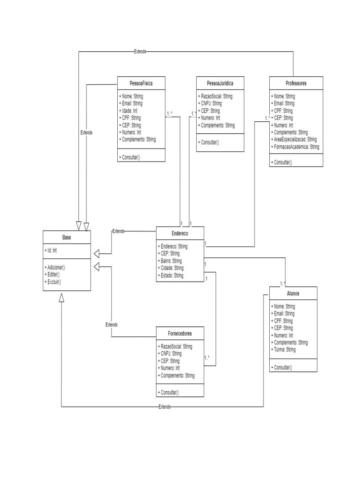
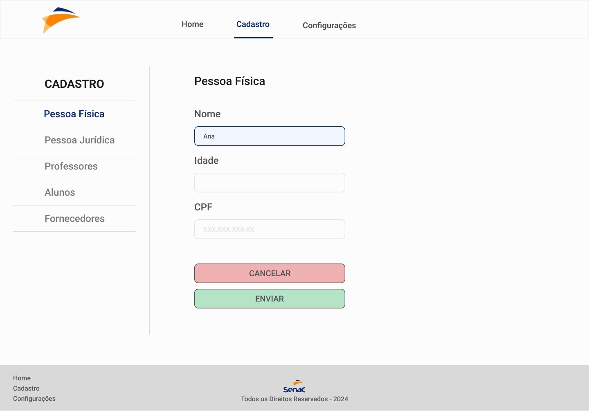
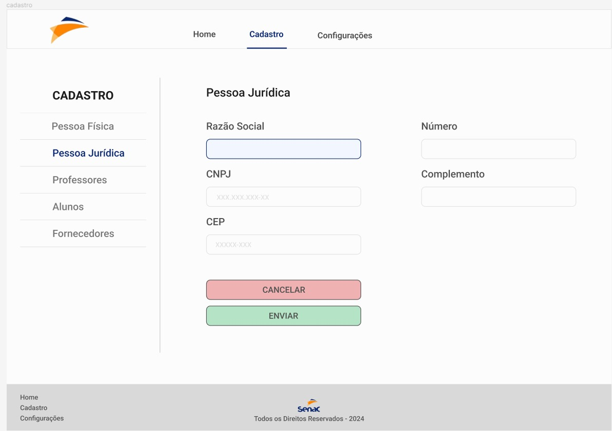
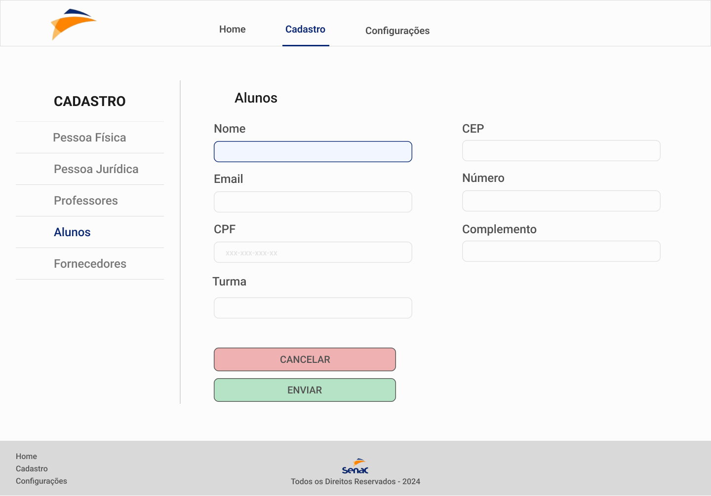

# Projeto Integrador II 2304 - SENAC

## Objetivo
Este repositório é dedicado ao trabalho do Projeto Integrador II, apresentando o trabalho em equipe.

## Integrantes do Grupo
O projeto é realizado por um grupo de 6 integrantes:

- João Paulo Cavalcante de Lima
- Lucas Albuquerque Jorge
- Yara Corrêa de Sá
- Rayane Magdalena Alves
- Tiago Tadashi Lecheta Shimizu
- Marco Antônio Casanova

## Descrição do Projeto
A equipe desenvolveu um sistema contemplando os seguintes casos de uso, cada um baseado nos diagramas de classes UML elaborados.

# Casos de Uso

## Cadastro de Pessoa Física

### Cenário Principal
- **Ator**: Usuário
- **Pré-condição**: O sistema está operacional.
- **Fluxo Principal**:
  1. O usuário escolhe a opção de cadastrar Pessoa Física.
  2. O sistema exibe um formulário para inserir nome, idade e CPF.
  3. O usuário preenche as informações e confirma o cadastro.
  4. O sistema valida os dados, armazena a Pessoa Física no banco de dados.
  5. O sistema exibe uma mensagem de sucesso.
- **Pós-condição**: Uma nova Pessoa Física é registrada no sistema.

### Cenários Alternativos
- **Cancelamento do Cadastro**:
  - Durante o preenchimento do formulário, o usuário decide cancelar o cadastro.
  - O sistema pergunta se o usuário tem certeza.
  - Se confirmado, o sistema retorna à tela inicial.
  - **Pós-condição Alternativa**: O cadastro é cancelado.

- **Dados Inválidos**:
  - O usuário preenche o formulário com dados inválidos.
  - O sistema exibe mensagens de erro.
  - O usuário ajusta os dados e tenta novamente.
  - **Pós-condição Alternativa**: O sistema não registra a Pessoa Física até que dados válidos sejam fornecidos.

## Cadastro de Pessoa Jurídica

### Cenário Principal
- **Ator**: Operador do Sistema
- **Pré-condição**: O sistema de gestão empresarial está operacional.
- **Fluxo Principal**:
  1. O operador do sistema escolhe a opção de cadastrar Pessoa Jurídica.
  2. O sistema exibe um formulário para inserir informações como razão social, CNPJ, endereço e contato da empresa.
  3. O operador preenche as informações e confirma o cadastro.
  4. O sistema valida os dados e armazena a Pessoa Jurídica no banco de dados.
  5. O sistema exibe uma mensagem de sucesso.
- **Pós-condição**: Uma nova Pessoa Jurídica é registrada no sistema.

### Cenários Alternativos
- **Cancelamento do Cadastro**:
  - Durante o preenchimento do formulário, o operador decide cancelar o cadastro.
  - O sistema pergunta se o operador tem certeza da ação.
  - Se confirmado, o sistema retorna à tela anterior.
  - **Pós-condição Alternativa**: O cadastro é cancelado.

- **Dados Inválidos**:
  - O operador preenche o formulário com dados inválidos ou incompletos.
  - O sistema exibe mensagens de erro.
  - O operador ajusta os dados e tenta o cadastro novamente.
  - **Pós-condição Alternativa**: O sistema não registra a Pessoa Jurídica até que dados válidos e completos sejam fornecidos.

## Cadastro de Professores

### Cenário Principal
- **Ator**: Secretário Acadêmico
- **Pré-condição**: O sistema de gestão acadêmica está operacional.
- **Fluxo Principal**:
  1. O secretário acadêmico escolhe a opção de cadastrar um novo professor.
  2. O sistema exibe um formulário para inserir informações pessoais e profissionais do professor, como nome, CPF, formação acadêmica, área de especialização e contato.
  3. O secretário preenche as informações e confirma o cadastro.
  4. O sistema valida os dados e armazena as informações do professor no banco de dados.
  5. O sistema exibe uma mensagem de sucesso.
- **Pós-condição**: Um novo professor é registrado no sistema.

### Cenários Alternativos
- **Cancelamento do Cadastro**:
  - Durante o preenchimento do formulário, o secretário decide cancelar o cadastro.
  - O sistema pergunta se o secretário tem certeza da ação.
  - Se confirmado, o sistema retorna à tela anterior.
  - **Pós-condição Alternativa**: O cadastro é cancelado.

- **Dados Inválidos**:
  - O secretário preenche o formulário com dados inválidos ou incompletos.
  - O sistema exibe mensagens de erro.
  - O secretário ajusta os dados e tenta o cadastro novamente.
  - **Pós-condição Alternativa**: O sistema não registra o novo professor até que dados válidos e completos sejam fornecidos.

## Cadastro de Aluno

### Cenário Principal
- **Ator**: Usuário
- **Pré-condição**: O sistema está operacional e o usuário tem permissão para cadastrar alunos.
- **Fluxo Principal**:
  1. O usuário seleciona a opção de cadastrar um novo Aluno.
  2. O sistema exibe um formulário para inserir nome, idade, CPF e matrícula do aluno.
  3. O usuário preenche as informações e confirma o cadastro.
  4. O sistema valida os dados e armazena o Aluno no banco de dados.
  5. O sistema exibe uma mensagem de confirmação.
- **Pós-condição**: Um novo Aluno é registrado no sistema.

### Cenários Alternativos
- **Cancelamento do Cadastro**:
  - Durante o preenchimento do formulário, o usuário decide cancelar o cadastro.
  - O sistema pergunta se o usuário tem certeza.
  - Se confirmado, o sistema retorna à tela inicial.
  - **Pós-condição Alternativa**: O cadastro é cancelado.

- **Dados Incompletos**:
  - O usuário deixa campos obrigatórios em branco.
  - O sistema destaca os campos que precisam ser preenchidos obrigatoriamente.
  - O usuário corrige os campos em branco e tenta novamente.
  - **Pós-condição Alternativa**: O sistema não registra o Aluno até que todos os campos obrigatórios sejam preenchidos.

## Gerenciamento de Pedidos de Fornecedores

### Cenário Principal
- **Ator**: Gerente de compras
- **Pré-condição**: O sistema de gestão de compras está operacional e o gerente de compras está autenticado.
- **Fluxo Principal**:
  1. O gerente de compras acessa a funcionalidade de gerenciamento de pedidos de fornecedores.
  2. O sistema exibe a lista de pedidos pendentes.
  3. O gerente seleciona um pedido específico para revisar.
  4. O sistema apresenta os detalhes do pedido, incluindo itens, quantidades, fornecedor e prazo de entrega.
  5. O gerente de compras revisa as informações e confirma a aprovação do pedido.
  6. O sistema exibe uma mensagem de confirmação.
- **Pós-condição**: O pedido é aprovado e registrado no sistema, e o fornecedor é notificado.

### Cenários Alternativos
- **Rejeição do Pedido**:
  - Durante a revisão do pedido, o gerente de compras decide rejeitar o pedido.
  - O sistema solicita uma justificativa para a rejeição.
  - O gerente de compras fornece uma justificativa e confirma a rejeição.
  - O sistema registra a rejeição.
  - O sistema confirma a rejeição e exibe uma mensagem de confirmação.
  - **Pós-condição Alternativa**: O pedido é rejeitado.

- **Modificação do Pedido**:
  - Durante a revisão do pedido, o gerente de compras identifica a necessidade de modificar a quantidade de um item.
  - O sistema permite a edição da quantidade do item no pedido.
  - O gerente de compras ajusta a quantidade, confirma a modificação e aprova o pedido.
  - O sistema registra as modificações.
  - O sistema exibe uma mensagem confirmando o item modificado e confirmando o pedido com aprovação.
  - **Pós-condição Alternativa**: O pedido é aprovado com modificações.

## Diagramas UML

## Telas
Representação das interfaces de usuário conforme os casos de uso.

- Cadastro de Pessoa Física

- Cadastro de Pessoa Jurídica

- Cadastro de Professores

- Cadastro de Fornecedores

- Cadastro de Alunos

